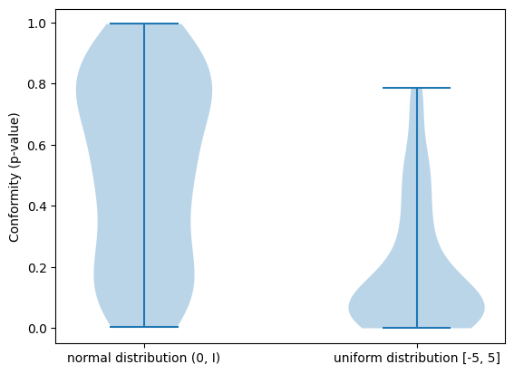

# Distributional Conformity Score

The Distributional Conformity Score (DCS) is a measure of similarity between a generated sample and a reference distribution. DCS can be interpreted as the fraction of examples in the validation set of a reference distribution that are more dissimilar from the reference distribution than the evaluated data point, based on a similarity metric. A higher DCS score indicates greater conformity to the reference distribution.

In the context of antibody design, DCS is used to evaluate the biological similarity of newly generated designs to a set of known expressing antibodies.

## Computing features for antibodies
To obtain features for DCS, you can use any relevant metrics such as labels derived from the AA sequence with Biopython (Cock et al., 2009) or ab-likeness. These can then be used as tabular data for density estimation and DCS computation (shown below).


## Example
This simplified example shows how to compute DCS. It assumes that features for the reference distribution and test data have been previously calculated.

To keep things simple, we simulate the features of a reference distribution using a normal distribution and compute DCS on two sets of samples: one drawn from the same distribution and another from a distinct, uniform distribution [-2.5, 2.5].

```python
import torch

# Pick some reference distribution
mu = torch.zeros(5)
covariance_matrix = torch.eye(5)
reference_distribution = torch.distributions.MultivariateNormal(mu, covariance_matrix)

X_train = reference_distribution.sample((1000,))
X_val = reference_distribution.sample((200,))

# Evaluate on samples from uniform distribution
X_test_1 = reference_distribution.sample((100,))
X_test_2 = torch.rand(100, 5) * 5 - 2.5

```


```python
# Fit a density estimator to the training data

from sklearn.neighbors import KernelDensity

kde = KernelDensity(kernel='gaussian', bandwidth=0.2)
kde.fit(X_train)
```


```python
# Get log probability of validation data and test data
log_prob_val = torch.from_numpy(kde.score_samples(X_val))

log_prob_test_1 = torch.from_numpy(kde.score_samples(X_test_1))
log_prob_test_2 = torch.from_numpy(kde.score_samples(X_test_2))
```


```python
# Use validation log probabilities to compute conformity scores
from walkjump.conformity import conformity_score

conformity_test_1 = conformity_score(
    log_prob_test_1,
    log_prob_val
)

conformity_test_2 = conformity_score(
    log_prob_test_2,
    log_prob_val
)
```


```python
# Plot distribution of conformity scores for each evaluated set

import matplotlib.pyplot as plt

plt.violinplot([conformity_test_1, conformity_test_2])
plt.ylabel("Conformity (p-value)")
plt.xticks([1, 2], ["#1 normal distribution (0, I)", "#2 uniform distribution [-2.5, 2.5]", ])
plt.show()
```





```python
# Mean conformity as a single statistic

#    - > 0.5: higher conformity, more similar to training data than validation data
#    - 0.5: optimal conformity, as on average, the test and validation data are equally likely under the reference distribution
#    - < 0.5: lower conformity, validation is more similar to training data than test data


mean_conformity_test_1 = conformity_test_1.mean()
mean_conformity_test_2 = conformity_test_2.mean()

print(f"Mean conformity for #1: {mean_conformity_test_1:.2f}")
print(f"Mean conformity for #2: {mean_conformity_test_2:.2f}")
```

    Mean conformity for #1: 0.53
    Mean conformity for #2: 0.19
